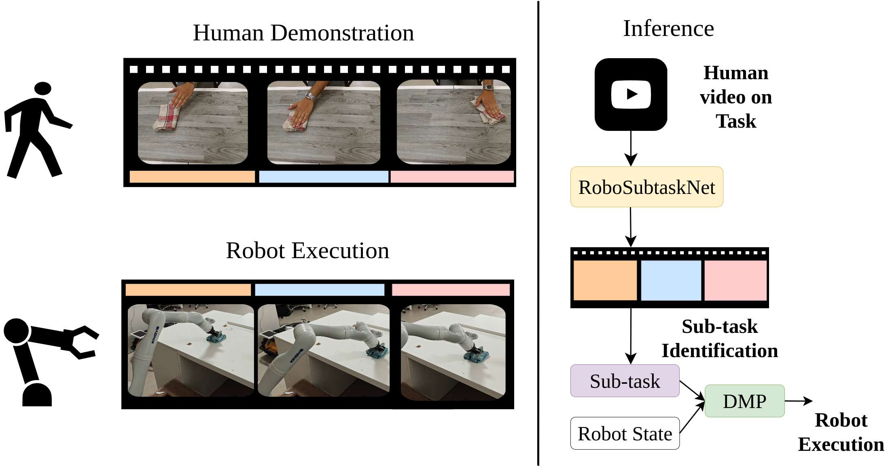
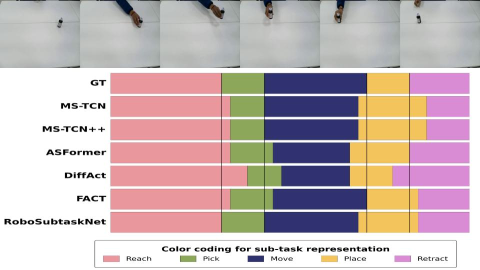
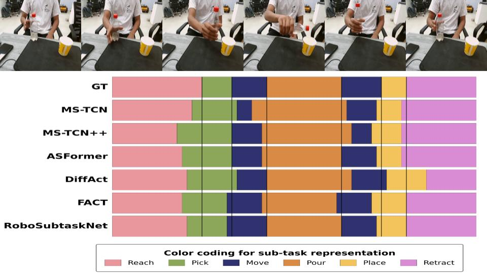

# RoboSubtaskNet — Workflow Pipeline

A basic-level showcase of **RoboSubtaskNet**: a two-stream (RGB +
optical-flow I3D features) multi-stage temporal convolutional network
(MS-TCN backbone with Fibonacci dilations) for frame-wise **temporal
action segmentation** of robot-manipulation subtasks, with end-to-end
validation on a real Kinova Gen3 arm.

This repo is meant to be cloned, installed, and run in a couple of
minutes — a trained checkpoint, a small runnable sample of the dataset,
testing/evaluation code, qualitative visualization code (including the
5 baseline architectures so the full 6-model comparison figure below can
be regenerated), and a demonstration video. It is **not** the full
research artifact: for the complete dataset (2080 videos) and the raw-
video-to-features preprocessing pipeline, see the permanent repository,
**RoboSubtaskNet** *(link will point to its own GitHub URL once
published)*.

## Pipeline



Human demonstration video → RoboSubtaskNet sub-task segmentation → DMP
goal resolution → robot execution, without retraining the control policy.

## Demo video

[`demo/RoboSubtaskNet_IROS_demo.mp4`](demo/RoboSubtaskNet_IROS_demo.mp4)
— the IROS submission demonstration video: the Kinova Gen3 arm executing
all four manipulation tasks end to end, driven by RoboSubtaskNet's
sub-task predictions (see [Pipeline](#pipeline) above for the mechanism
this demonstrates).

`demo/` also has three shorter test clips (`pick_place_demo_1.avi`,
`pick_pour_demo_1.avi`, `pick_pour_demo_2.avi`) captured while testing
the live-inference pipeline on the same two tasks shown in the
[qualitative results](#qualitative-results) below — informal, not as
polished as the main demo video, but real footage of the model running.

## Results (as reported in the paper)

| Model | F1@10 | F1@25 | F1@50 | Edit | Accuracy |
|---|---|---|---|---|---|
| MS-TCN | 98.83 | 98.68 | 95.67 | 98.52 | 93.00 |
| MS-TCN++ | 98.43 | 98.41 | 94.39 | 98.39 | 93.18 |
| ASFormer | 99.21 | 99.21 | 87.97 | 99.27 | 94.41 |
| DiffAct | 98.28 | 96.57 | 88.38 | 98.98 | 88.58 |
| FACT | 99.24 | 99.34 | 97.63 | 99.48 | 93.47 |
| **RoboSubtaskNet** | **99.34** | **99.21** | **97.50** | **99.48** | **94.33** |

These are the paper's official numbers. **This repo also ships each
model's trained checkpoint so you can reproduce them yourself** — doing
so may show slight differences from the table above (a few tenths of a
point for most models; a bit more for DiffAct, which uses stochastic
diffusion sampling at inference). This is expected and documented in
[`baselines/README.md`](baselines/README.md), including exactly which
checkpoint/epoch produced each number and why.

## Qualitative results

Ground truth vs. all 6 models' predictions on representative test videos
(regenerable — see below):




## Quick start

```bash
pip install -r requirements.txt -r baselines/requirements.txt

# RoboSubtaskNet: predict + evaluate on the included sample
python main.py --action predict
python eval.py

# Regenerate the combined 6-model qualitative figure above
python visualize_fig5_all.py --task pick_place --robo_idx 482
python visualize_fig5_all.py --task pick_pour  --robo_idx 512
```

`eval.py`'s output here reflects only the **8-video sample** included in
this repo (a quick, small demo, not the full 160-video test set), so its
aggregate numbers will look different from the reference table above —
that's expected. See [baselines/README.md](baselines/README.md) for how
to reproduce each baseline's own numbers, and the permanent repo for
evaluation against the full test set.

## What's included

```
RoboSubtaskNet_Showcase/
├── model.py  batch_gen.py  main.py  eval.py     # RoboSubtaskNet testing code
├── visualize_fig5_all.py                        # visualization code (all 6 models)
├── norm_stats_rgb.npz  norm_stats_flow.npz  class_weights.npy
├── model/bottleneck_h128fm48_dropout03/          # our trained checkpoint
├── results/bottleneck_h128fm48_dropout03/        # full 160-video precomputed predictions
├── paper_results/                                # official reference metrics/plots (full test set)
├── baselines/                                     # 5 baseline architectures, same trained-checkpoint
│   ├── README.md                                 #   pattern as the permanent repo -- see it for
│   └── MSTCN/ MSTCN2/ ASFormer/ DiffAct/ FACT/    #   checkpoint provenance + reproduction notes
├── dataset/                                       # SMALL SAMPLE: 8 representative test videos
│   ├── test/{features_rgb,features_flow,groundtruth}/
│   ├── splits/{test,val}.bundle
│   └── mapping.txt
├── figures/                                       # workflow pipeline + qualitative comparison figures
├── demo/                                           # IROS demo video + 3 informal test clips
├── requirements.txt  baselines/requirements.txt
├── LICENSE
└── README.md
```

## Dataset sample

`dataset/` here ships 8 of the 160 held-out test videos (2 per task),
selected to be **representative** — each video's average accuracy across
all 6 models is close to that model's overall test-set average, rather
than a cherry-picked best case. Just enough to run the testing and
visualization code out-of-the-box without downloading the full ~1GB
dataset. The full 1920-train/160-test dataset lives in the permanent
repo.

## Setup

```bash
pip install -r requirements.txt -r baselines/requirements.txt
```

Tested with Python 3.10+, PyTorch 2.5+ (CUDA 11.8/12.1).

## License

MIT + Commons Clause (see [LICENSE](LICENSE)) — free to use, modify, and
redistribute; commercial resale of the software itself is not permitted.
Baseline architectures in `baselines/` are adapted from their respective
upstream repositories (MS-TCN, MS-TCN++, ASFormer, DiffAct, FACT).

## Citation

If you use this code, please cite the associated paper. A citation entry
will be added here once the paper is published; in the meantime please
contact the authors.
